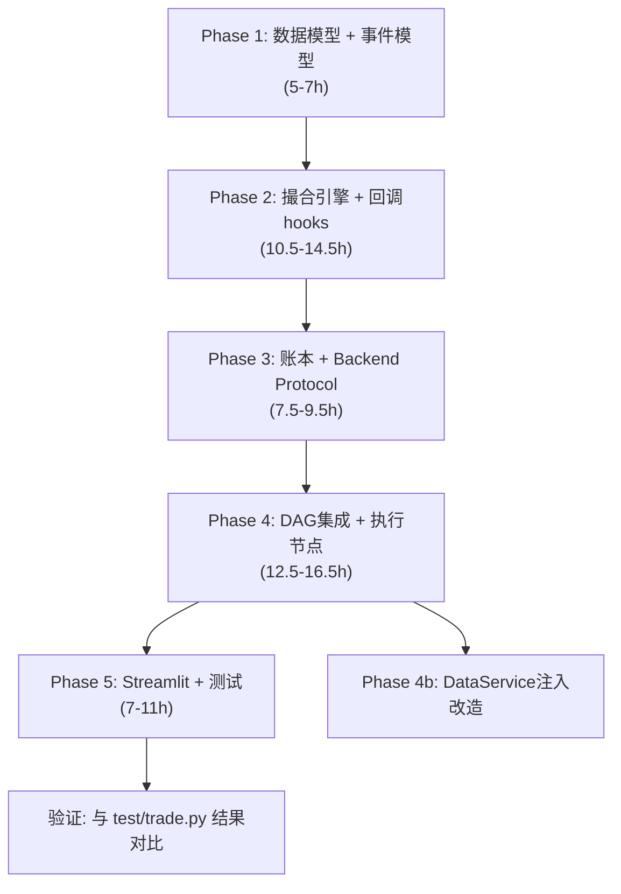

# Gap C: Broker Mock + Feedback — 完整实施计划

> **版本**: Final (合并自 [impl_plan_v1.md](./impl_plan_v1.md) + [impl_plan_v2.md](./impl_plan_v2.md))
> **最后更新**: 2026-04-13
> **负责人**: Gap C 组

---

## 0 执行规约与质量门禁

本计划从现在开始受以下规约约束，后续所有实现、测试、验收和 review 都以此为准：

1. **工具使用范围**
   - 可以使用本地任意相关 `skill`；如需读取 PDF，优先使用 `/pdf` skill。
   - 可以自由使用互联网检索工具做事实核验、官方文档检索和方案调研。
   - 鼓励使用 sub-agent 并行做代码审计/信息收集，但关键设计决策与最终整合必须回到主执行链路统一收口。

2. **统一工程工作流**
   - 项目统一由 `uv` 管理；安装、运行、测试、类型检查、格式化都使用 `uv run ...` 触发。
   - 类型与质量检查统一使用 `based-pyright` + `ruff`。
   - `pyproject.toml` 必须作为项目级质量配置源，不能只依赖编辑器本地设置；其中 `pyright` 配置由 `basedpyright` CLI 直接消费。

3. **质量门禁（强约束）**
   - `pyproject.toml` 中必须显式规定 `pyright.typeCheckingMode = "standard"`，并由 `basedpyright` 执行项目级类型检查。
   - 所有新增或修改后的 Python 代码都必须同时通过：
     - `uv run basedpyright`
     - `uv run ruff check .`
     - `uv run ruff format --check .`
   - 验收标准为 **0-warning / 0-error**；若仓库存在历史问题，必须在对应 Phase 中显式记录、消化或隔离，不能静默带过。

4. **严格 TDD 流程（强约束）**
   - 严格遵循 `tdd` skill 的 `red -> green -> refactor` 流程实施。
   - 禁止“先把所有测试写完，再一次性把实现补完”的 horizontal slicing。
   - 每次只推进一个垂直切片：先写一个失败的行为测试，再写最小实现让它通过，最后在绿色状态下重构。
   - 测试优先验证公共接口和可观察行为，而不是内部实现细节。

5. **必要注释规范**
   - 默认坚持“代码即注释”；不要为显而易见的赋值、样板字段或直白控制流补充废话式注释。
   - 当代码包含以下内容时，必须补充简短英文注释：
     - 量化/交易领域约定，例如多空符号、PnL 口径、费率单位、滑点含义
     - 跨 Phase 预留字段或为了后续集成保留的结构
     - 依赖仓库上下文才能理解的非显然约束或默认值
     - 非显然的测试/工程胶水代码，例如导入路径修正、可变默认值规避
   - 注释应优先解释“为什么这样设计”或“这个约定代表什么”，不要逐字复述代码表面行为。
   - 语言要求：简明英文、短句、低门槛表达；除必要术语外尽量避免晦涩词汇和长难句。

---

## 1 项目背景与目标

### 1.1 当前状况

- 系统存在 `test/trade.py` 脚本级别的回测逻辑，但**未模块化**、**不在主应用链路中**
- PM Agent 输出 `Action` + `Target_position_pct` 后即结束，无后续执行/反馈环节
- `dataflow/portfolio_manager.py` 有基础的持仓状态管理，但未与交易逻辑联动
- 回测评估 (`test/eva.py`) 是独立的后处理脚本，与 Agent 系统解耦

### 1.2 Gap C 核心目标（来自 WORKLOAD_GAP_ANALYSIS）

1. **标准化 Broker 接口** — `place/cancel/query/orderbook/position`
2. **统一订单与成交生命周期** — `NEW → PARTIALLY_FILLED → FILLED → CANCELED`
3. **执行结果 → 反馈回代理决策 的持续闭环**

### 1.3 完成标志

- 一个可插拔的 `BrokerGateway` Protocol + `MockBroker` 实现
- 支持 `MARKET / LIMIT` 订单，含手续费 & 滑点模型
- 完整的账户/持仓/交易日志系统
- PM 决策 → 自动执行 → 执行结果写回 State → 可选触发重新分析
- Streamlit 中可查看交易日志与绩效指标

---

## 2 设计决策记录

### 2.1 已确认的设计决策

| # | 决策项 | 选择 | 理由 |
| --- | -------- | ------ | ------ |
| 1 | 数值精度 | **`float`** | 与现有代码一致（`TradingDecision.target_position_pct: float`、`test/trade.py` 全部用 float）；与 Pydantic / LangGraph / JSON 序列化天然兼容；学术/模拟项目精度足够 |
| 2 | 订单撮合模式 | **简化撮合** | 市价单以当前 bar close ± 滑点立即全额成交；限价单检查价格触及后全额成交；日线级别不需要部分成交 / Order Book 深度模拟；状态机保留 `PARTIALLY_FILLED` 定义以备扩展 |
| 3 | 反馈闭环深度 | **两阶段推进** | Phase 1 先实现"记录+单向反馈"（执行结果写入 State，持仓更新同步至 PortfolioManager），Phase 2 添加重新评估的条件边 |
| 4 | 执行时机 | **当日收盘价 ± 滑点** | 与现有 `test/trade.py` 保持一致；配置中预留 `execution_timing` 参数 (`close_bar` / `next_open`)，未来可切换 |
| 5 | 多 Ticker 回测策略 | **外层循环** | 不侵入 Agent 层，仅 Broker 层改造；增量工作量 ~7.5h；**详见 §7** |

### 2.2 无争议的技术决策

| 决策项 | 选择 | 理由 |
| -------- | ------ | ------ |
| 接口抽象模式 | Python `Protocol` (typing) | 文档示例已用 Protocol，零依赖，与现有代码风格一致 |
| 模块目录 | `broker/` 顶层包 | 文档规划的目录结构已明确 |
| 配置管理 | Pydantic `BaseSettings` | 项目已引入 Pydantic，天然适合 |
| 标识符生成 | `uuid4` | 订单/成交 ID 无外部依赖，唯一性保证 |
| 数据时间处理 | `datetime` (UTC) | 项目已用 ISO 格式 UTC 字符串 |
| 测试框架 | `pytest` | Python 社区标准，项目已有 test/ 目录 |

---

## 3 分阶段实施方案

### Phase 1: 数据模型层 （预估 5-7h）

建立所有数据模型、枚举和事件模型，这是后续所有 Phase 的基础。

#### [NEW] `broker/models.py`

核心数据模型定义：

```python
# 枚举类型
class OrderSide(str, Enum): BUY / SELL
class OrderType(str, Enum): MARKET / LIMIT
class OrderStatus(str, Enum): NEW / PARTIALLY_FILLED / FILLED / CANCELED / REJECTED

# 数据模型 (Pydantic BaseModel, 所有模型均含 session_id 字段 — Gap A 预留)
class Order:           # 订单（含 id, ticker, side, type, qty, limit_price, status, timestamps, session_id）
class Fill:            # 成交记录（含 order_id, fill_price, fill_qty, fee, slippage, timestamp, session_id）
class Position:        # 单只股票持仓（含 ticker, shares, avg_cost, side, unrealized_pnl）
class AccountSnapshot: # 账户快照（含 cash, equity, positions, timestamp, session_id）
class ExecutionReport: # 执行报告（含 order, fills, position_before, position_after, account_after,
                       #           pm_action, pm_report_summary, timestamp）
```

> **跨模块预留**: `ExecutionReport` 包含 `pm_action` + `pm_report_summary` 字段，供 Gap D 通知系统直接消费。

#### [NEW] `broker/config.py`

```python
class BrokerConfig(BaseSettings):
    initial_cash: float = 100_000.0
    commission_rate: float = 0.001
    slippage_rate: float = 0.0005
    execution_timing: str = "close_bar"       # "close_bar" | "next_open"
    max_position_pct: float = 1.0             # 单只股票最大仓位
    max_total_position_pct: float = 1.0       # 多 Ticker 总仓位上限（预留）
    allow_short: bool = True
```

#### [NEW] `broker/events.py`

结构化事件模型（Gap E 审计链路预留）：

```python
class BrokerEvent(BaseModel):
    """Broker 事件基类 — Gap E 审计链路接入"""
    event_type: str          # "order_placed" / "order_filled" / "order_rejected" / "risk_check_failed"
    timestamp: str
    session_id: str = ""
    ticker: str = ""
    details: dict = {}
```

---

### Phase 2: 撮合引擎 + Broker 接口 （预估 10.5-14.5h）

实现核心交易引擎和标准化接口。

#### [NEW] `broker/gateway.py`

```python
class BrokerGateway(Protocol):
    """标准化 Broker 接口（Protocol），未来可替换为真实券商"""
    def get_account(self) -> AccountSnapshot: ...
    def get_positions(self) -> list[Position]: ...
    def get_position(self, ticker: str) -> Position | None: ...
    def place_order(self, order: Order) -> Order: ...
    def cancel_order(self, order_id: str) -> Order: ...
    def get_order(self, order_id: str) -> Order | None: ...
    def get_orders(self, status: OrderStatus | None = None) -> list[Order]: ...
    def get_fills(self, order_id: str | None = None) -> list[Fill]: ...
```

#### [NEW] `broker/engine.py`

`MockBrokerEngine` — 实现 `BrokerGateway`：

- **核心能力**：
  - 账户资金管理（cash, equity 计算）
  - 持仓追踪（多空统一，avg_cost 加权更新）— **使用 `dict[str, Position]` 适配多 Ticker**
  - 订单簿管理（pending orders 列表）
  - 市价单即时撮合
  - 限价单条件触发
  - 手续费 + 滑点扣减
  - Realized / Unrealized PnL 计算

- **关键方法**：
  - `place_order()` → 创建订单 → 尝试撮合
  - `_try_fill_market()` → 市价撮合
  - `_try_fill_limit()` → 限价撮合
  - `_execute_fill()` → 实际成交处理（更新持仓、现金、PnL）
  - `on_bar()` → 接收 `dict[str, BarData]` 多 Ticker bar 数据，检查 pending limit orders

- **复用 `test/trade.py` 的核心逻辑**：
  现有 trade.py L222-268 的多空统一 Position & PnL 逻辑将被提取并封装到 engine 中。

- **跨模块预留（事件回调 hooks）**：

```python
class MockBrokerEngine:
    def __init__(self, config: BrokerConfig):
        ...
        # 多 Ticker 持仓
        self._positions: dict[str, Position] = {}
        # 事件日志（Gap E 审计）
        self._event_log: list[BrokerEvent] = []
        # 事件回调（Gap D 通知）
        self._on_fill_callbacks: list[Callable[[Fill, Position, AccountSnapshot], None]] = []
        self._on_order_callbacks: list[Callable[[Order], None]] = []

    def register_on_fill(self, callback):
        """注册成交事件回调 — Gap D 通知系统接入"""
        self._on_fill_callbacks.append(callback)

    def register_on_order(self, callback):
        """注册订单事件回调 — Gap D 通知系统接入"""
        self._on_order_callbacks.append(callback)

    def get_event_log(self) -> list[BrokerEvent]:
        """获取所有事件 — Gap E 可直接消费"""
        return self._event_log.copy()

    def _execute_fill(self, ...):
        ...
        # 记录事件
        self._event_log.append(BrokerEvent(event_type="order_filled", ...))
        # 触发回调
        for cb in self._on_fill_callbacks:
            cb(fill, position, account)
```

#### [NEW] `broker/risk_checks.py`

下单前风控检查（前置校验层）：

```python
class PreTradeRiskChecker:
    def check(self, order: Order, account: AccountSnapshot) -> tuple[bool, str]:
        """返回 (通过, 原因)"""
        # 1. 资金充足性检查
        # 2. 单只股票仓位上限检查
        # 3. 做空权限检查
        # 4. 订单合理性检查（qty > 0, price > 0 for limit）
```

---

### Phase 3: 账户/持仓账本 + 交易日志 （预估 7.5-9.5h）

#### [NEW] `broker/ledger.py`

交易日志和绩效统计系统，含**存储后端抽象**（Gap A 接入点）：

```python
class TradeLedgerBackend(Protocol):
    """存储后端抽象 — Gap A 接入点"""
    def persist_fill(self, fill: Fill, position: Position, account: AccountSnapshot) -> None: ...
    def persist_daily_snapshot(self, date: str, account: AccountSnapshot) -> None: ...
    def load_fills(self, session_id: str | None = None) -> list[Fill]: ...
    def load_snapshots(self, session_id: str | None = None) -> list[AccountSnapshot]: ...

class InMemoryLedgerBackend:
    """默认内存实现 — Gap A 未就绪时使用"""
    ...

class TradeLedger:
    """交易记录 & 绩效指标计算"""

    def __init__(self, backend: TradeLedgerBackend | None = None):
        self._backend = backend or InMemoryLedgerBackend()

    def record_fill(self, fill: Fill, position: Position, account: AccountSnapshot): ...
    def record_daily_snapshot(self, date: str, account: AccountSnapshot): ...

    # 绩效指标
    def compute_metrics(self) -> dict:
        """计算: 总收益率, 年化收益率, 最大回撤, 夏普比率, 胜率, 盈亏比"""

    # 导出
    def to_trades_dataframe(self) -> pd.DataFrame: ...
    def to_portfolio_dataframe(self) -> pd.DataFrame: ...
    def to_csv(self, trades_path: str, portfolio_path: str): ...
```

> **合并时**: Gap A 团队只需实现 `SqliteLedgerBackend(TradeLedgerBackend)` 即可接入。

**绩效指标清单**：

- Total Return / Annualized Return
- Max Drawdown / Max Drawdown Duration
- Sharpe Ratio（无风险利率可配置）
- Win Rate / Profit Factor
- Avg Win / Avg Loss / Payoff Ratio
- Number of Trades / Avg Holding Period

#### [MODIFY] `dataflow/portfolio_manager.py`

改造现有 `PortfolioManager`，使其与 `MockBrokerEngine` 联动：

- 新增 `sync_from_broker(broker: BrokerGateway)` 方法
- 执行后自动调用 `sync_from_broker()` 更新持仓状态
- 保持向后兼容（原有 `update_position()` 接口不变）

---

### Phase 4: 与主工作流集成 — 反馈闭环 （预估 12.5-16.5h）

这是最关键的阶段，将 Broker 系统接入 LangGraph Agent DAG。

#### [MODIFY] `agentgraph/state.py`

新增字段到 `AgentState`：

```python
class AgentState(MessagesState):
    # ... 现有字段保持不变 ...

    # ========== 新增：执行层字段 (Gap C 核心) ==========
    execution_report: Annotated[Optional[str], "本轮执行报告（JSON序列化）"] = ""
    execution_enabled: Annotated[bool, "是否启用自动执行"] = False

    # ========== 新增：会话追踪 (Gap A 预留) ==========
    session_id: Annotated[Optional[str], "会话ID，用于持久化追踪"] = ""

    # ========== Gap B 预留：HITL 审批（注释形式，合并时由 Gap B 团队取消注释） ==========
    # approval_status: Annotated[Optional[str], "审批状态: auto_approved/pending/approved/rejected/modified"] = "auto_approved"
    # modified_target_pct: Annotated[Optional[float], "审批修改后的目标仓位"] = None

    # ========== Gap E 预留：决策流审计（注释形式） ==========
    # execution_events: Annotated[Optional[str], "执行层事件列表（JSON序列化）"] = ""
```

#### [NEW] `agentgraph/execution_node.py`

新增 LangGraph 执行节点，含**持久化回调 hook**（Gap A 接入）和**审批状态检查**（Gap B 接入）：

```python
def create_execution_node(broker: BrokerGateway, on_execution_complete=None):
    """创建执行节点 — PM 决策后自动下单"""
    def execution_node(state: AgentState):
        if not state.get("execution_enabled", False):
            return {}  # 未启用执行，跳过

        # Gap B 接入点: 检查审批状态
        approval_status = state.get("approval_status", "auto_approved")
        if approval_status == "rejected":
            return {"execution_report": "REJECTED — 审批未通过，不执行"}

        action = state.get("Action", "HOLD")
        target_pct = state.get("Target_position_pct", 0.0)
        ticker = state.get("ticker", "")

        # 如果审批修改了参数（Gap B）
        if approval_status == "modified":
            target_pct = state.get("modified_target_pct", target_pct)

        if action == "HOLD":
            return {"execution_report": "HOLD — 无需执行"}

        # 1. 计算目标股数
        # 2. 构建 Order
        # 3. 调用 broker.place_order()
        # 4. 生成 ExecutionReport
        # 5. 同步 PortfolioManager

        report = ExecutionReport(...)

        # Hook: 持久化回调 — Gap A 接入
        if on_execution_complete:
            on_execution_complete(report, state)

        return {"execution_report": report.model_dump_json()}

    return execution_node
```

#### [MODIFY] `agentgraph/orchestrator.py`

扩展 DAG 图——在 PM 节点后增加执行节点，含 **Gap B HITL 插入点**：

```text
标准模式: START → [并行分析] → risk_analyst → PM_agent → execution_node → END
HITL 模式: START → [并行分析] → risk_analyst → PM_agent → [hitl_approval] → execution_node → END
无执行:   START → [并行分析] → risk_analyst → PM_agent → END（向后兼容）
```

关键改动：

```python
class IntelliFin_Assistant:
    def __init__(self, broker=None, enable_hitl=False):
        ...
        if broker:
            wf.add_node("execution_node", self._create_execution_node(broker))

            if enable_hitl:
                # Gap B 模式: PM → hitl_approval → execution → END
                wf.add_edge("PM_agent", "hitl_approval")
                wf.add_edge("hitl_approval", "execution_node")
            else:
                # 标准模式: PM → execution → END
                wf.add_edge("PM_agent", "execution_node")

            wf.add_edge("execution_node", END)
        else:
            wf.add_edge("PM_agent", END)  # 向后兼容
```

#### [MODIFY] `dataflow/service.py`

可选注入 Broker，实现持仓数据统一：

```python
class DataService:
    def __init__(self, fallback_local_root="data", broker=None):
        self.local_root = fallback_local_root
        self.portfolio_manager = PortfolioManager()
        self._broker = broker  # 可选注入

    def df_get_position(self, ticker):
        if self._broker:
            pos = self._broker.get_position(ticker)
            if pos:
                return self._convert_broker_position(pos)
        return self.portfolio_manager.get_position(ticker)
```

#### [MODIFY] `agents/utils/agent_tools.py`

将 DataService 从模块级单例改为可配置的工厂模式：

```python
_data_service: DataService | None = None

def get_data_service() -> DataService:
    global _data_service
    if _data_service is None:
        _data_service = DataService()
    return _data_service

def set_data_service(service: DataService):
    """外部注入 DataService（回测模式）"""
    global _data_service
    _data_service = service
```

> [!WARNING]
> 这个改动影响所有 agent_tools 中的 4 个 `@tool` 函数。虽然改动小，但它是所有 Agent 取数据的入口，需要谨慎测试。建议在 Phase 4 集成稳定后再做（Phase 4b），降低风险。

#### [NEW] `broker/backtest_runner.py`

将 `test/trade.py` 重构为正式的回测入口：

```python
class BacktestRunner:
    """回测运行器 — 替代 test/trade.py"""

    def __init__(self, config: BrokerConfig):
        self.broker = MockBrokerEngine(config)
        self.ledger = TradeLedger()
        self.agent = IntelliFin_Assistant(broker=self.broker)

    def run(self, ticker: str, price_df: pd.DataFrame,
            start_date: str, end_date: str) -> BacktestResult:
        """逐日遍历 → Agent分析 → 执行 → 记录"""
        for date, bar in price_df.iterrows():
            # 1. broker.on_bar(bar) — 更新市场数据
            # 2. agent.run(ticker, date, current_pct) — 获取决策
            # 3. 执行（通过 execution_node 或直接调用）
            # 4. ledger.record_daily_snapshot()

        return BacktestResult(
            trades=self.ledger.to_trades_dataframe(),
            portfolio=self.ledger.to_portfolio_dataframe(),
            metrics=self.ledger.compute_metrics()
        )
```

---

### Phase 5: Streamlit UI + 测试 （预估 7-11h）

#### [MODIFY] `streamlit_app.py`

在 Streamlit 中新增 Broker / 回测相关页面：

1. **回测配置面板**（侧边栏扩展）
   - 初始资金、手续费率、滑点率配置
   - 日期范围选择
   - 执行/非执行模式切换

2. **交易日志页面**
   - 交易明细表格（trades DataFrame）
   - 每日组合状态表格（portfolio DataFrame）

3. **绩效指标面板**
   - 关键 KPI 卡片（收益率、最大回撤、夏普比、胜率）
   - 权益曲线图（Strategy vs Benchmark）
   - 回撤曲线图

#### [NEW] `test/test_broker.py`

Pytest 单元测试 + 集成测试：

```python
# 单元测试
class TestOrderModels: ...        # 模型创建与验证
class TestMockBrokerEngine: ...
    # test_place_market_buy
    # test_place_market_sell
    # test_place_limit_buy_triggered
    # test_place_limit_buy_not_triggered
    # test_cancel_order
    # test_short_selling
    # test_position_pnl_calculation
    # test_insufficient_funds_rejection
    # test_commission_and_slippage

class TestPreTradeRiskChecker: ... # 风控检查
class TestTradeLedger: ...         # 日志与指标

# 集成测试
class TestExecutionNode: ...       # 执行节点与 AgentState 集成
class TestBacktestRunner: ...      # 端到端回测流程
```

---

## 4 文件清单总览

```text
broker/                          # [NEW] 顶层模块
├── __init__.py                  # [NEW] 包初始化 & 便捷导出
├── models.py                    # [NEW] 数据模型与枚举（含 session_id, pm_action 等跨模块字段）
├── config.py                    # [NEW] 配置 (含 max_total_position_pct 预留)
├── gateway.py                   # [NEW] BrokerGateway Protocol
├── engine.py                    # [NEW] MockBrokerEngine（含事件回调 hooks + 事件日志）
├── risk_checks.py               # [NEW] 下单前风控检查
├── ledger.py                    # [NEW] 交易日志（含 TradeLedgerBackend Protocol）
├── events.py                    # [NEW] 结构化事件模型（Gap E 预留）
└── backtest_runner.py           # [NEW] 回测运行器（多 Ticker 预留）

agentgraph/
├── state.py                     # [MODIFY] 新增执行/会话字段 + Gap B/E 注释预留
├── orchestrator.py              # [MODIFY] 新增 execution_node + enable_hitl 预留
└── execution_node.py            # [NEW] 执行节点（含持久化回调 hook + 审批检查）

dataflow/
├── service.py                   # [MODIFY] 可选 Broker 注入
└── portfolio_manager.py         # [MODIFY] sync_from_broker()

agents/utils/
└── agent_tools.py               # [MODIFY] DataService 工厂模式（Phase 4b）

streamlit_app.py                 # [MODIFY] 新增交易日志/绩效面板

test/
└── test_broker.py               # [NEW] 完整测试套件
```

---

## 5 跨模块接入点总览

代码最终将与其他 Gap 团队合并，以下是 Gap C 需要预留的全部接入点：

### 5.1 Gap A: ContextStore 持久化层

| 接入点 | 位置 | 接入方式 | 说明 |
| -------- | ------ | -------- | ------ |
| TradeLedger 存储后端 | `broker/ledger.py` | `TradeLedgerBackend` Protocol | Gap A 实现 `SqliteLedgerBackend` 即可接入 |
| ExecutionReport 持久化 | `agentgraph/execution_node.py` | `on_execution_complete` 回调 hook | 执行完成后触发持久化 |
| session_id 追踪 | `state.py` + `broker/models.py` | 新增 `session_id` 字段 | 所有模型均带此字段，串联完整会话 |

### 5.2 Gap B: HITL 审批闭环

| 接入点 | 位置 | 接入方式 | 说明 |
| -------- | ------ | -------- | ------ |
| DAG 边可插拔 | `orchestrator.py` | `enable_hitl` 参数 + 条件边 | `PM → [hitl_approval] → execution → END` |
| 审批状态检查 | `execution_node.py` + `state.py` | 预留 state 字段 + 条件判断 | `approval_status` / `modified_target_pct` |

> **Gap B 推荐模式**: LangGraph `interrupt()` + `Command(resume=...)` 原生 HITL pattern。

### 5.3 Gap D: 多渠道通知

| 接入点 | 位置 | 接入方式 | 说明 |
| -------- | ------ | -------- | ------ |
| 成交/订单事件回调 | `broker/engine.py` | `register_on_fill/order()` 回调列表 | Gap D 调用 `broker.register_on_fill(notification.on_fill)` |
| ExecutionReport 上下文 | `broker/models.py` | 模型字段含 `pm_action` / `pm_report_summary` | 通知消息可直接消费 |

### 5.4 Gap E: 决策流可视化与审计

| 接入点 | 位置 | 接入方式 | 说明 |
| -------- | ------ | -------- | ------ |
| 结构化事件日志 | `broker/events.py` + `engine.py` | `BrokerEvent` 模型 + `_event_log` 列表 | Gap E 调用 `broker.get_event_log()` 即可 |
| AgentState 审计 trail | `state.py` | `execution_events` 注释预留字段 | 合并时取消注释 |

### 5.5 与现有 DataService / PortfolioManager 的统一

| 接入点 | 位置 | 接入方式 | 说明 |
| -------- | ------ | -------- | ------ |
| DataService 持仓同步 | `dataflow/service.py` | 可选 Broker 注入 (`__init__(broker=)`) | 优先从 Broker 获取实时持仓 |
| DataService 单例改造 | `agents/utils/agent_tools.py` | `get/set_data_service()` 工厂模式 | 解决回测模式下无法注入的问题 |

### 接入点工作量汇总

| 接入目标 | 工作量 |
| -------- | -------- |
| Gap A: 持久化 (3 点) | ~2h |
| Gap B: HITL (2 点) | ~1.5h |
| Gap D: 通知 (2 点) | ~1.5h |
| Gap E: 审计 (2 点) | ~1.5h |
| DataService 统一 (2 点) | ~1h |
| **合计** | **~7.5h** |

---

## 6 依赖变更

运行时依赖无需新增额外外部服务依赖；Broker 实现仍以现有栈为主。项目级开发/质量依赖需要在 `pyproject.toml` 中明确：

- `pydantic` — 数据模型
- `pandas` — DataFrame 操作
- `numpy` — 数值计算
- `plotly` / `streamlit` — 可视化
- `pytest` — TDD / 自动化测试
- `ruff` — lint + format
- `basedpyright` — 标准类型检查

所有验证命令统一通过 `uv run ...` 执行，避免出现游离于项目配置之外的本地工作流。

---

## 7 多 Ticker 并行回测评估

### 7.1 当前架构障碍分析

| 障碍 | 描述 | 影响程度 |
| ------ | ------ | -------- |
| `AgentState` 单 Ticker | `ticker: str` + `current_position_pct: float` 假设单股 | ⚠️ 高 |
| Agent→Tool 调用链 | 所有 Agent 从 `state["ticker"]` 取单 ticker | ⚠️ 高 |
| 仓位计算 | `position_value / equity` 在多 Ticker 时需要组合级 equity | 🔶 中 |
| PortfolioManager | `_positions` 已支持多 Ticker dict，但 `current_position_pct` 语义模糊 | 🔶 中 |
| 时间对齐 | 不同市场/停牌日需要处理 | 🔶 中 |

### 7.2 方案对比

#### 方案 A: "外层循环" — 每 Ticker 独立 DAG 调用 ✅ 推荐

```python
for each trading_day:
    for each ticker in portfolio:
        result = agent.run(ticker, date, current_pct[ticker])
        broker.place_order(...)
    broker.mark_to_market(all_prices)  # 统一更新 equity
```

| 维度 | 评价 |
| ------ | ------ |
| Agent 层改动 | ✅ 零改动 |
| 架构适配性 | ✅ 天然适配当前设计 |
| 可并发 | ✅ `asyncio.gather()` 并行 |
| 合并冲突 | ✅ 不影响其他 Gap |
| 组合协调 | ❌ 需后处理（总仓位超限则等比缩放） |
| 增量工作量 | ~7.5h |

#### 方案 B: "DAG 内批量" — 改造 AgentState ❌ 不推荐

| 维度 | 评价 |
| ------ | ------ |
| Agent 层改动 | ❌ 全部 5 个 Agent 重写 |
| 架构适配性 | ❌ AgentState 爆炸（5分析师 × N Ticker） |
| 合并冲突 | ❌ 与所有 Gap 冲突 |
| 增量工作量 | 40-60h |

### 7.3 分阶段推进计划

| 阶段 | 内容 | 前置 |
| ------ | ------ | ------ |
| **本次 (Phase 1-5)** | 单 Ticker 完整实现 + Broker 设计上支持多 Ticker `dict` | 无 |
| **后续** | `BacktestRunner` 支持 `tickers: list[str]`，外层循环 + 价格对齐 | Phase 1-5 完成 |
| **可选** | 组合级风控（总仓位上限、Ticker 间相关性检查） | 上述完成 |

### 7.4 Phase 1 中为多 Ticker 预留的 5 个设计点

1. `MockBrokerEngine._positions: dict[str, Position]` — 一开始就用 dict
2. `on_bar(bars: dict[str, BarData])` — bar 数据接口支持多 Ticker
3. `get_positions() -> list[Position]` — 返回全部持仓列表
4. `TradeLedger` 的 fill/snapshot 记录带 `ticker` 字段
5. `BrokerConfig.max_total_position_pct: float = 1.0` — 预留总仓位上限

---

## 8 验证计划

### 8.1 自动化测试

```bash
# 质量门禁
uv run basedpyright
uv run ruff check .
uv run ruff format --check .

# 运行所有单元测试
uv run pytest test/test_broker.py -v

# 运行特定测试类
uv run pytest test/test_broker.py::TestMockBrokerEngine -v

# 端到端集成测试（不调 LLM，用 mock 数据）
uv run pytest test/test_broker.py::TestBacktestRunner -v
```

### 8.2 手动验证

1. **模型验证**: 手动构建 Order/Fill 对象并验证字段约束
2. **撮合验证**: 与 `test/trade.py` 对比同一数据集的交易结果，确保一致
3. **DAG 验证**: 运行 `agent.visualize()` 确认新增 execution_node 正确连接
4. **UI 验证**: 在 Streamlit 中运行一次回测，检查交易日志和绩效面板

### 8.3 回归测试

- 确保不传 broker 时，系统行为与修改前完全一致
- 现有的 CLI (`app.py`) 和 Streamlit 入口不受影响

---

## 9 执行顺序与工作量

### 9.1 执行流程



每个 Phase 完成后都应通过单元测试验证，确保可独立交付。Phase 4b (DataService 注入改造) 因为涉及现有代码，建议在 Phase 4 集成稳定后再做，降低风险。

### 9.2 工作量汇总

| Phase | 内容 | 核心工作量 | 接入点+多Ticker预留 | 合计 |
| ------ | ------ | ----------- | ------------------- | ------ |
| Phase 1 | 数据模型层 | 4-6h | +1h | **5-7h** |
| Phase 2 | 撮合引擎 + 接口 | 8-12h | +2.5h | **10.5-14.5h** |
| Phase 3 | 账本 + 绩效指标 | 6-8h | +1.5h | **7.5-9.5h** |
| Phase 4 | 主流程集成 + 反馈闭环 | 10-14h | +2.5h | **12.5-16.5h** |
| Phase 5 | Streamlit UI + 测试 | 6-10h | +1h | **7-11h** |
| **Total** | | **34-50h** | **+8.5h** | **42.5-58.5h** |

> [!TIP]
> 以上预估已考虑"AI Agent 辅助开发"的效率提升。如果大部分编码交给 Agent，实际人力投入主要在 review + 决策 + 调试。预估时间约为 WORKLOAD_GAP_ANALYSIS 文档中 M3 (100-140 小时) 的 30-40%。接入点的工作主要是**定义 Protocol/Hook/预留字段**，代码量不大但设计决策很关键，不使用时零运行时开销。
