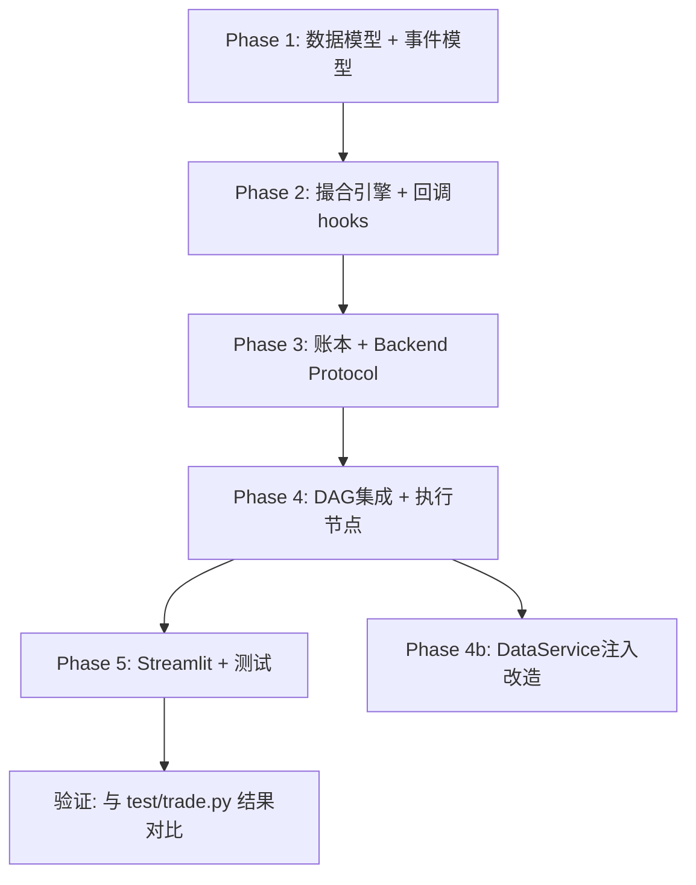

# Gap C: Broker Mock + Feedback 实施计划 (v2)

## 变更说明

本版在 [impl_plan_v1.md](./impl_plan_v1.md) 基础上，新增以下内容：

1. **跨模块接入点全面分析** — 涵盖 Gap A/B/D/E 全部对接需求
2. **多 Ticker 并行回测深度评估** — Q3 展开分析
3. **设计决策已全部确认** — 采用 float / 简化撮合 / 两阶段闭环 / 收盘价执行

> [!NOTE]
> 原版中的分阶段实施方案（Phase 1-5）、文件清单、依赖变更、验证计划均保持不变，请参考原版文档。本文档聚焦**新增内容**。

---

## 一、跨模块接入点全面分析

通过深入分析整个项目的代码和 5 个 Gap 的设计目标，我识别出以下 **所有** 需要 Gap C 预留接入点的位置。

### 1. Gap A: ContextStore 持久化层 — 接入点

Gap A 将引入 `ContextStore` 抽象 + SQLite 实现，用于持久化 session/agent_report/tool_log/pm_decision/execution 等数据。

#### 接入点 1.1: `TradeLedger` 存储后端抽象

**现状（我们的设计）**: `TradeLedger` 用内存 `list` 保存 fills/snapshots，提供 `to_csv()` 导出。

**预留设计**:

```python
# broker/ledger.py
class TradeLedgerBackend(Protocol):
    """存储后端抽象 — Gap A 接入点"""
    def persist_fill(self, fill: Fill, position: Position, account: AccountSnapshot) -> None: ...
    def persist_daily_snapshot(self, date: str, account: AccountSnapshot) -> None: ...
    def load_fills(self, session_id: str | None = None) -> list[Fill]: ...
    def load_snapshots(self, session_id: str | None = None) -> list[AccountSnapshot]: ...

class InMemoryLedgerBackend:
    """默认内存实现 — Gap A 未就绪时使用"""
    ...

class TradeLedger:
    def __init__(self, backend: TradeLedgerBackend | None = None):
        self._backend = backend or InMemoryLedgerBackend()
```

**合并时**: Gap A 团队只需实现 `SqliteLedgerBackend(TradeLedgerBackend)` 即可接入。

#### 接入点 1.2: `ExecutionReport` 持久化

**现状**: `execution_report` 作为 JSON 字符串存入 `AgentState`，一轮结束即丢失。

**预留设计**: 在 `execution_node` 中添加 hook 点：

```python
# agentgraph/execution_node.py
def create_execution_node(broker, on_execution_complete=None):
    def execution_node(state):
        ...
        report = ExecutionReport(...)

        # Hook: 持久化回调 — Gap A 接入
        if on_execution_complete:
            on_execution_complete(report, state)

        return {"execution_report": report.model_dump_json()}
    return execution_node
```

#### 接入点 1.3: `session_id` 追踪

**现状**: orchestrator 中 `thread_id` 硬编码为 `"42"`。

**预留设计**: 在 `AgentState` 中新增 `session_id` 字段，同时 Broker 模型也带 `session_id`：

```python
# agentgraph/state.py 新增
session_id: Annotated[Optional[str], "会话ID，用于持久化追踪"] = ""

# broker/models.py — Order / Fill / AccountSnapshot 均增加 optional session_id 字段
class Order(BaseModel):
    session_id: str = ""  # Gap A 接入后填充
    ...
```

---

### 2. Gap B: HITL 审批闭环 — 接入点

Gap B 将在 PM 决策后插入审批节点。根据 LangGraph 最新文档，推荐使用 `interrupt()` + `Command(resume=...)` 模式。

#### 接入点 2.1: DAG 边的可插拔设计

**现状（我们的设计）**: `PM_agent → execution_node → END`

**预留设计**: orchestrator 中的边连接通过配置控制：

```python
# agentgraph/orchestrator.py
class IntelliFin_Assistant:
    def __init__(self, broker=None, enable_hitl=False):
        ...
        if broker:
            wf.add_node("execution_node", self._create_execution_node(broker))

            if enable_hitl:
                # Gap B 模式: PM → hitl_approval → execution → END
                # hitl_approval 节点将由 Gap B 团队注入
                wf.add_edge("PM_agent", "hitl_approval")
                wf.add_edge("hitl_approval", "execution_node")
            else:
                # 标准模式: PM → execution → END
                wf.add_edge("PM_agent", "execution_node")

            wf.add_edge("execution_node", END)
        else:
            wf.add_edge("PM_agent", END)
```

**关键**: 我们不实现 `hitl_approval` 节点本身（那是 Gap B 的工作），但预留 `enable_hitl` 参数和节点插入点。

#### 接入点 2.2: `execution_node` 中的审批状态检查

**预留设计**: execution_node 检查 state 中是否有审批结果：

```python
# agentgraph/execution_node.py
def execution_node(state):
    # Gap B 接入点: 检查审批状态
    approval_status = state.get("approval_status", "auto_approved")
    if approval_status == "rejected":
        return {"execution_report": "REJECTED — 审批未通过，不执行"}
    if approval_status == "modified":
        # 使用审批修改后的参数
        target_pct = state.get("modified_target_pct", state.get("Target_position_pct"))
    ...
```

在 `AgentState` 中预留 HITL 字段：

```python
# agentgraph/state.py 新增（注释标记为 Gap B 预留）
# ========== Gap B 预留：HITL 审批 ==========
# approval_status: Annotated[Optional[str], "审批状态: auto_approved/pending/approved/rejected/modified"] = "auto_approved"
# modified_target_pct: Annotated[Optional[float], "审批修改后的目标仓位"] = None
```

---

### 3. Gap D: 多渠道通知 — 接入点

Gap D 将实现 Telegram/WhatsApp 通知，包括交易执行通知、审批请求等。

#### 接入点 3.1: 交易事件通知 Hook

Broker 的执行结果是通知系统的核心数据源。

**预留设计**: 在 `MockBrokerEngine` 中添加事件回调列表：

```python
# broker/engine.py
from typing import Callable

class MockBrokerEngine:
    def __init__(self, config: BrokerConfig):
        ...
        self._on_fill_callbacks: list[Callable[[Fill, Position, AccountSnapshot], None]] = []
        self._on_order_callbacks: list[Callable[[Order], None]] = []

    def register_on_fill(self, callback):
        """注册成交事件回调 — Gap D 通知系统接入"""
        self._on_fill_callbacks.append(callback)

    def register_on_order(self, callback):
        """注册订单事件回调 — Gap D 通知系统接入"""
        self._on_order_callbacks.append(callback)

    def _execute_fill(self, ...):
        ...
        # 通知回调
        for cb in self._on_fill_callbacks:
            cb(fill, position, account)
```

**合并时**: Gap D 团队只需调用 `broker.register_on_fill(notification_service.on_fill)` 即可。

#### 接入点 3.2: `ExecutionReport` 数据供通知使用

`ExecutionReport` 模型已包含通知所需的全部信息（订单详情、成交价、仓位变化、账户快照），Gap D 可直接消费：

```python
# broker/models.py — ExecutionReport 应包含足够的上下文
class ExecutionReport(BaseModel):
    order: Order
    fills: list[Fill]
    position_before: Position | None
    position_after: Position | None
    account_after: AccountSnapshot
    pm_action: str          # "BUY"/"SELL"/"HOLD"
    pm_report_summary: str  # 一句话结论，供通知消息使用
    timestamp: str
```

---

### 4. Gap E: 决策流可视化与审计 — 接入点

Gap E 将构建"节点输入输出+工具调用+关键参数"的事件记录和审计链路。

#### 接入点 4.1: 执行节点结构化事件

**预留设计**: 为 `execution_node` 的每一步骤生成结构化事件，方便 Gap E 采集：

```python
# broker/events.py — [NEW] 事件模型定义
class BrokerEvent(BaseModel):
    """Broker 事件基类 — Gap E 审计链路接入"""
    event_type: str          # "order_placed" / "order_filled" / "order_rejected" / "risk_check_failed"
    timestamp: str
    session_id: str = ""
    ticker: str = ""
    details: dict = {}

# broker/engine.py 中产出事件
class MockBrokerEngine:
    def __init__(self, ...):
        self._event_log: list[BrokerEvent] = []

    def get_event_log(self) -> list[BrokerEvent]:
        """获取所有事件 — Gap E 可直接消费"""
        return self._event_log.copy()

    def _execute_fill(self, ...):
        self._event_log.append(BrokerEvent(
            event_type="order_filled",
            timestamp=...,
            details={"order_id": ..., "fill_price": ..., "fill_qty": ...}
        ))
```

#### 接入点 4.2: AgentState 中的审计 trail

```python
# agentgraph/state.py — 预留审计字段
# ========== Gap E 预留：决策流审计 ==========
# execution_events: Annotated[Optional[str], "执行层事件列表（JSON序列化）"] = ""
```

---

### 5. 与现有 DataService / PortfolioManager 的接口统一

#### 接入点 5.1: `DataService.df_get_position()` 与 Broker 同步

**现状**: `DataService.df_get_position()` 调用 `PortfolioManager.get_position()`，而 `PortfolioManager` 独立维护持仓（dict），与 Broker 无关。

**问题**: Broker 执行交易后，持仓数据存在两份来源 — `MockBrokerEngine._positions` 和 `PortfolioManager._positions`——需要同步。

**预留设计**: `PortfolioManager` 新增 `sync_from_broker()` 方法（已在原版计划中），同时在 `DataService` 中通过可选依赖注入 Broker：

```python
# dataflow/service.py
class DataService:
    def __init__(self, fallback_local_root="data", broker=None):
        self.local_root = fallback_local_root
        self.portfolio_manager = PortfolioManager()
        self._broker = broker  # 可选注入

    def df_get_position(self, ticker):
        if self._broker:
            # 优先从 Broker 获取实时持仓
            pos = self._broker.get_position(ticker)
            if pos:
                return self._convert_broker_position(pos)
        return self.portfolio_manager.get_position(ticker)
```

#### 接入点 5.2: `agent_tools.py` 中的 DataService 单例问题

**现状**: `agents/utils/agent_tools.py` 第 8 行创建了模块级 `_data_service = DataService()` 单例。回测模式下，Broker 需要注入到 DataService，但全局单例导致无法注入。

**预留设计**: 将 DataService 改为可配置的工厂模式或延迟初始化：

```python
# agents/utils/agent_tools.py
_data_service: DataService | None = None

def get_data_service() -> DataService:
    global _data_service
    if _data_service is None:
        _data_service = DataService()
    return _data_service

def set_data_service(service: DataService):
    """外部注入 DataService（回测模式）"""
    global _data_service
    _data_service = service
```

> [!WARNING]
> 这个改动影响所有 agent_tools 中的 4 个 `@tool` 函数。虽然改动小，但它是所有 Agent 取数据的入口，需要谨慎测试。

---

### 接入点总览表

| 接入目标 | 位置 | 接入方式 | 工作量 |
|---------|------|---------|-------|
| Gap A: TradeLedger 持久化 | `broker/ledger.py` | `TradeLedgerBackend` Protocol | ~1h |
| Gap A: ExecutionReport 持久化 | `agentgraph/execution_node.py` | `on_execution_complete` 回调 | ~0.5h |
| Gap A: session_id 追踪 | `state.py` + `broker/models.py` | 新增字段 | ~0.5h |
| Gap B: DAG 边可插拔 | `orchestrator.py` | `enable_hitl` 参数 + 条件边 | ~1h |
| Gap B: 审批状态检查 | `execution_node.py` + `state.py` | 预留 state 字段 + 条件判断 | ~0.5h |
| Gap D: 成交/订单事件回调 | `broker/engine.py` | `register_on_fill/order` 回调列表 | ~1h |
| Gap D: ExecutionReport 上下文 | `broker/models.py` | 模型字段扩展 | ~0.5h |
| Gap E: 结构化事件日志 | `broker/events.py` + `engine.py` | `BrokerEvent` + `_event_log` | ~1.5h |
| 现有: DataService 注入 | `service.py` + `agent_tools.py` | 可选 Broker 注入 + 工厂模式 | ~1h |
| **合计** | | | **~7.5h** |

---

## 二、多 Ticker 并行回测深度评估

### 当前 Agent 架构对多 Ticker 的限制分析

通过深入研读代码，我识别出从"单 Ticker"到"多 Ticker"的 **5 个关键障碍**：

#### 障碍 1: `AgentState` 硬编码为单 Ticker

```python
# agentgraph/state.py L18-22
ticker: Annotated[str, "股票代码"]      # 单值
date: Annotated[str, "日期"]
current_position_pct: Annotated[float, "当前持仓百分比"]  # 隐含：只有一只股票
```

`current_position_pct` 假设整个系统只管理一只股票的仓位。多 Ticker 时，需要变为 `dict[str, float]` 或者**每只 Ticker 独立调用一次完整的 Agent DAG**。

#### 障碍 2: Agent -> Tool 调用链假设单 Ticker

所有 Agent (market/news/fundamentals) 从 `state["ticker"]` 取单个 ticker，触发工具调用。多 Ticker 时，有两种方案：

- **A**: 每只 Ticker 独立跑一次完整 DAG（当前架构天然支持，只需外层循环）
- **B**: 改造 DAG 支持内部批量处理多 Ticker（需大量重构 State + Agent 代码）

#### 障碍 3: Broker Engine 持仓管理

**当前设计**（单 Ticker）: 持仓计算用 `position_value / equity` 得到仓位百分比。

**多 Ticker 挑战**:

- `equity = cash + Σ(position_i × price_i)` — equity 是全局的
- 每只 Ticker 的仓位百分比 = `position_i × price_i / equity`
- PM 说"AAPL 加仓到 30%"，需要同时考虑其他持仓的占比
- 需要**组合级别的仓位管理**而非单 ticker 级别

#### 障碍 4: `PortfolioManager` 数据模型

`PortfolioManager._positions` 已是 `Dict[str, Dict]`（支持多 Ticker 存储），但 `get_position()` 只返回单 Ticker 信息，`current_position_pct` 的语义在多 Ticker 时模糊。

#### 障碍 5: 回测循环的时间对齐

多只股票可能不在同一交易日有数据（如 A 股 vs 美股、停牌日差异）。回测逻辑需要处理：

- 时间对齐（union or intersection of trading days）
- 某只股票停牌时的持仓估值
- 汇率转换（如果涉及跨市场）

---

### 两种多 Ticker 架构方案对比

#### 方案 A: "外层循环" — 每 Ticker 独立 DAG 调用（推荐）

```python
for each trading_day:
    for each ticker in portfolio:
        result = agent.run(ticker, date, current_pct[ticker])
        broker.place_order(...)
    broker.mark_to_market(all_prices)  # 统一更新 equity
```

**优点**:

- ✅ **零改造 Agent 层** — Agent/State/Tool 全部不需要改动
- ✅ **天然适配当前架构** — 当前系统就是为单 Ticker 设计的
- ✅ **可并发** — 不同 Ticker 的 Agent 调用可以 `asyncio.gather()` 并行
- ✅ **逐步实现** — Phase 1 单 Ticker → Phase 2 外层循环即可支持多 Ticker

**缺点**:

- ❌ LLM 调用次数 = Ticker 数 × 5 Agents × 每日交易日 → 成本/时间线性增长
- ❌ 各 Ticker 的 PM 决策独立，缺乏"组合级别"的仓位协调（如总仓位上限）

**需要改造的点（仅在 Broker 层）**:

| 改造项 | 描述 | 工作量 |
|--------|------|-------|
| `MockBrokerEngine._positions` | 改为 `dict[str, Position]` 多 Ticker 持仓 | ≈ 已支持 |
| `get_account()` 计算 | `equity = cash + Σ(pos × price)` | ~1h |
| `on_bar()` 接收 | 接收 `dict[str, BarData]` 多 Ticker bar | ~1h |
| `BacktestRunner.run()` | 外层循环 + 多 Ticker 价格对齐 | ~3h |
| `TradeLedger` | 按 Ticker 分组记录和统计 | ~1.5h |
| 组合级风控 | 总仓位上限检查 | ~1h |
| **合计** | | **~7.5h** |

#### 方案 B: "DAG 内批量" — 改造 AgentState 支持多 Ticker

```python
# AgentState 改造为
tickers: list[str]
current_positions: dict[str, float]
market_reports: dict[str, str]
news_reports: dict[str, str]
...
```

**优点**:

- ✅ 理论上可以让 PM 做"组合级别决策"（考虑各股票间的相关性）

**缺点**:

- ❌ **需要重写几乎所有 Agent 代码** — 5 个 Agent 全部要适配
- ❌ **AgentState 爆炸** — 5 个分析师 × N Ticker = 5N 个 messages 列表
- ❌ **与其他团队的 Gap 冲突** — 其他人也在修改 AgentState，合并地狱
- ❌ 工作量巨大，估计 40-60 小时额外工作

---

### 建议方案

> [!IMPORTANT]
> **推荐方案 A（外层循环）**，理由：
>
> 1. 工作量可控（~7.5h 增量），且大部分在 Broker 层完成，不侵入 Agent 层
> 2. 不会引起与 Gap A/B/D/E 的代码合并冲突
> 3. 当前 LLM 调用已经较慢（`test/trade.py` 中每天 sleep 15s），多 Ticker 时可 async 并行优化
> 4. "组合级别仓位协调"可作为简单的后处理：所有 Ticker 的 PM 决策出来后，检查总仓位是否超限，超限则等比缩放

### 多 Ticker 实施的分阶段建议

| 阶段 | 内容 | 前置 |
| ------ | ------ | ------ |
| **Phase 1 (本次)** | 单 Ticker 完整实现 + Broker Engine 设计上支持多 Ticker `_positions` dict | 无 |
| **Phase 2 (后续)** | `BacktestRunner` 支持 `tickers: list[str]`，外层循环 + 价格对齐 | Phase 1 完成 |
| **Phase 3 (可选)** | 组合级风控（总仓位上限、Ticker 间相关性检查） | Phase 2 完成 |

**Phase 1 中为多 Ticker 预留的设计点**:

1. `MockBrokerEngine._positions: dict[str, Position]` — 一开始就用 dict
2. `on_bar(bars: dict[str, BarData])` — bar 数据接口支持多 Ticker
3. `get_positions() -> list[Position]` — 返回全部持仓列表
4. `TradeLedger` 的 fill/snapshot 记录带 `ticker` 字段
5. `BrokerConfig.max_total_position_pct: float = 1.0` — 预留总仓位上限

---

## 三、更新后的 AgentState 设计

综合所有接入点分析，`AgentState` 需要新增的字段如下：

```python
class AgentState(MessagesState):
    # ... 现有字段保持不变 ...

    # ========== 新增：执行层字段 (Gap C 核心) ==========
    execution_report: Annotated[Optional[str], "本轮执行报告（JSON序列化）"] = ""
    execution_enabled: Annotated[bool, "是否启用自动执行"] = False

    # ========== 新增：会话追踪 (Gap A 预留) ==========
    session_id: Annotated[Optional[str], "会话ID，用于持久化追踪"] = ""

    # ========== Gap B 预留（注释形式，合并时由 Gap B 团队取消注释） ==========
    # approval_status: Annotated[Optional[str], "审批状态"] = "auto_approved"
    # modified_target_pct: Annotated[Optional[float], "审批修改后的目标仓位"] = None

    # ========== Gap E 预留（注释形式） ==========
    # execution_events: Annotated[Optional[str], "执行层事件列表（JSON）"] = ""
```

---

## 四、更新后的文件清单

```text
broker/                          # [NEW] 顶层模块
├── __init__.py                  # [NEW] 包初始化 & 便捷导出
├── models.py                    # [NEW] 数据模型与枚举（含 session_id 预留）
├── config.py                    # [NEW] 配置 (含 max_total_position_pct 预留)
├── gateway.py                   # [NEW] BrokerGateway Protocol
├── engine.py                    # [NEW] MockBrokerEngine（含事件回调 hooks）
├── risk_checks.py               # [NEW] 下单前风控检查
├── ledger.py                    # [NEW] 交易日志（含 TradeLedgerBackend Protocol）
├── events.py                    # [NEW] 结构化事件模型（Gap E 预留）
└── backtest_runner.py           # [NEW] 回测运行器（多 Ticker 预留）

agentgraph/
├── state.py                     # [MODIFY] 新增执行/会话字段 + Gap B/E 注释预留
├── orchestrator.py              # [MODIFY] 新增 execution_node + hitl 预留
└── execution_node.py            # [NEW] 执行节点（含持久化回调 hook）

dataflow/
├── service.py                   # [MODIFY] 可选 Broker 注入
└── portfolio_manager.py         # [MODIFY] sync_from_broker()

agents/utils/
└── agent_tools.py               # [MODIFY] DataService 工厂模式

streamlit_app.py                 # [MODIFY] 新增交易日志/绩效面板

test/
└── test_broker.py               # [NEW] 完整测试套件
```

---

## 五、更新后的工作量预估

| Phase | 内容 | 原版预估 | 新增（接入点+多Ticker预留） | 合计 |
| ------- | ------ | -------- | -------------------------- | ------ |
| Phase 1 | 数据模型层 | 4-6h | +1h (session_id, events, 多Ticker dict) | 5-7h |
| Phase 2 | 撮合引擎 + 接口 | 8-12h | +2.5h (事件回调hooks, 多Ticker on_bar) | 10.5-14.5h |
| Phase 3 | 账本 + 绩效指标 | 6-8h | +1.5h (Backend Protocol, 多Ticker分组) | 7.5-9.5h |
| Phase 4 | 主流程集成 + 反馈闭环 | 10-14h | +2.5h (HITL预留, 持久化hook, DataService注入) | 12.5-16.5h |
| Phase 5 | Streamlit UI + 测试 | 6-10h | +1h (接入点相关测试) | 7-11h |
| **Total** | | **34-50h** | **+8.5h** | **42.5-58.5h** |

> [!TIP]
> 接入点的工作主要是**定义 Protocol/Hook/预留字段**，代码量不大但设计决策很关键。这些预留不会增加系统运行时复杂度（不使用时零开销），但在代码合并时会极大降低对接成本。

---

## 六、执行顺序建议



每个 Phase 完成后都应通过单元测试验证，确保可独立交付。Phase 4b (DataService 注入改造) 因为涉及现有代码，建议在 Phase 4 集成稳定后再做，降低风险。
